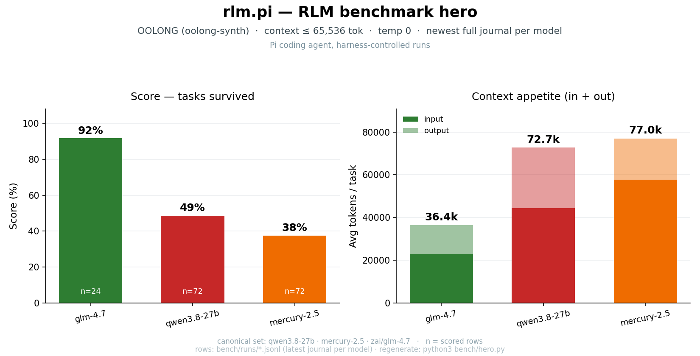

<div align="center">

# rlm.pi

**Рекурсивные языковые модели для Pi — контекст в миллион токенов на дешёвых моделях.**

Превратите <b>Pi</b> и <b>oh-my-pi</b> в исследовательских агентов, которые не «прочитывают»
документ на 500 страниц — они его <i>ищут</i>, в Python-REPL, пока ваша сильная модель
дирижирует армией дешёвых воркеров.

<p>
<a href="https://www.npmjs.com/package/@hicaru/pi-rlm"></a>
<a href="https://github.com/openzebra/rlm.pi/actions"></a>
<a href="https://arxiv.org/abs/2512.24601"></a>

</p>



<sub><a href="README.md">English</a> · <a href="README.zh-CN.md">中文</a> · <b>Русский</b></sub>

</div>

## Быстрый старт

```bash
pi install npm:@hicaru/pi-rlm        # Pi
omp plugin install @hicaru/pi-rlm    # oh-my-pi
```

Затем `/reload` (или перезапуск). Убедитесь, что `/rlm`, `/rlm-config`, `/rlm-stop`
появились в **[Extensions]**, и переключайте режим через `Ctrl+Shift+R` или `/rlm` —
обычные запросы теперь идут через движок RLM.

| | установка | обновление | удаление |
|---|---|---|---|
| **Pi** | `pi install npm:@hicaru/pi-rlm` | `pi install npm:@hicaru/pi-rlm --force` | `pi uninstall npm:@hicaru/pi-rlm` |
| **oh-my-pi** | `omp plugin install @hicaru/pi-rlm` | `omp plugin install @hicaru/pi-rlm --force` | `omp plugin uninstall @hicaru/pi-rlm` |

## Идея

Контекст не запихивается в промпт — он **живёт в песочнице**: файлы, PDF, репозитории,
логи сессий. Модель видит только индекс. Каждый шаг — одно переход состояния:

```
A_t = (P, Σ_t, O_t)          фиксированный промпт + состояние выполнения Σ_t + набор инструментов
ΔΣ_t = μ(A_t)                модель выдаёт repl()-патч, а не прозу
V(ΔΣ_t, Σ_t)                 детерминированный валидатор — без путей к краху
Σ_{t+1} = Σ_t ⊕ ΔΣ_t         глубокое слияние, null = удалить (статья, §5.7)
```

Сильная модель дирижирует (`P`); дешёвые воркеры платят за чтение (`llm_query`,
`rlm_query`); сложные подзадачи рекурсивно уходят в дочерние RLM — с лимитом глубины,
бюджетом и нулевой стоимостью наследования полной песочницы. Запросы живут между
ходами чата; устойчивый прогресс фиксируется как дельты `Σ`, проходя одну и ту же
лестницу валидации на каждом шаге. Нативные сессии бесплатно получают слой **Root Σ**:
стёртые ходы сворачиваются в архив сессии, `/compact` превращается в детерминированное
структурное резюме, а хранилище навыков `Ξ` переранжирует факты проекта в каждый промпт.

## Бенчмарки

Полный набор **OOLONG** (oolong-synth, 24 задачи, контекст до 128K токенов), свежейший
журнал на модель, стоимость из реального `costUsd`:

| Модель | OOLONG | токенов/задача | цена/задача |
|---|---|---|---|
| `zai/glm-4.7` | **91.7%** (22/24) | ~36k | ~$0.00 \* |
| `openrouter/qwen/qwen3.8-27b` | 49% | ~36k | $0.10 |
| `openrouter/inception/mercury-2.5` | 38% | ~36k | $0.005 |

\* Эндпоинт Z.ai coding-plan — подписочный биллинг, поэтому `costUsd` остаётся $0.

В [статье RLM](https://arxiv.org/abs/2512.24601) GPT-5-mini в роли RLM обходит GPT-o3
на OOLONG — рекурсия бьёт сырой контекст за малую долю цены.

Построчные результаты лежат в [`bench/runs/*.jsonl`](bench/runs/). Воспроизведение:

```bash
export OPENROUTER_API_KEY=sk-or-...    # для zai/* — ZAI_API_KEY
bun run bench --model zai/glm-4.7 --oolong-max-cl 65536 --oolong-limit 24
```

## Что вы получаете

| | pi-rlm даёт |
|---|---|
| **Исследования** | Map-reduce по репозиториям, PDF, логам — воркеры читают, ваша модель думает. |
| **Большой контекст** | Песочница вмещает всё при нулевой стоимости промпта; модель видит индекс. |
| **Экономия токенов** | Воркеры выбирают самую дешёвую доступную модель; чтение не касается основной. |
| **Долгие задачи** | Цели крутятся между ходами с лимитами глубины, бюджета и ошибок — вернётесь к готовому ответу. |
| **Плагин, а не агент** | Живёт внутри Pi/omp: ваша тема, инструменты, ключи, мышечная память. Тумблер `/rlm`. |
| **Читает что угодно** | `add_context("report.pdf")` — PDF, DOCX, XLSX, EPUB, CSV, HTML → Markdown, без препроцессинга. |

## Как это работает

```
 вы ──► промпт ──► движок RLM ──► сильная модель (ход за ходом, Python в repl())
                          │              │  search / grep / outline  (бесплатно)
                          │              ├─► llm_query ──► дешёвые воркеры
                          │              └─► rlm_query ──► дочерние RLM (лимит глубины)
                          └──► состояние Σ_t + валидация + бюджеты (токены, время, ошибки)
```

- **Сильная модель** думает и пишет Python в REPL.
- **Модели-воркеры** делают тяжёлую работу (читают, резюмируют, классифицируют).
- Сложные подзадачи **рекурсивно** уходят в дочерние RLM.

## Команды

| Команда | Горячая клавиша | Описание |
|---------|----------|-------------|
| `/rlm` | `Ctrl+Shift+R` | Переключить режим RLM (обычные запросы идут через движок) |
| `/rlm-stop` | | Прервать идущий запуск |
| `/rlm-config` | | Сэмплинг, бюджеты, флаги парадигмы |

## API песочницы

Видимая модели поверхность намеренно мала — только поиск и делегирование:

```python
search("needle", k=10)            # BM25-указатели в контекст
grep_context(pattern, k=50)       # совпадения регэкспа с номерами строк
outline(path)                     # скелет определений
add_context("report.pdf")         # подключить и сконвертировать любой документ
llm_query(prompt)                 # дешёвый воркер: текст на входе — текст на выходе
map_files(paths, prompt)          # один вопрос по многим файлам
rlm_query(task, paths=...)        # рекурсивный дочерний RLM
answers / plan                    # постоянная память между ходами
```

## Безопасность

- Движок **не делает дискового I/O** — запуск живёт в памяти; ответ — единственный сохраняемый артефакт.
- API-ключи никогда не попадают в песочницу: подвызовы LLM обслуживаются мостами на стороне хоста.
- Python работает в охраняемом подпроцессе со списком зарезервированных имён и диспетчеризацией прерываний.

## Лицензия

[MIT](pi-plugin/rlm/LICENSE) © hicaru contributors
