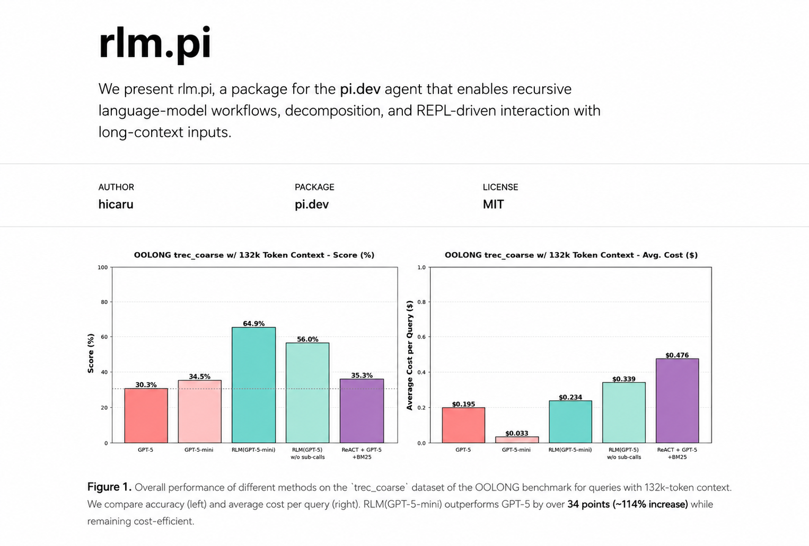

<div align="center">



</div>

<div align="center">

<sub>
**English** &nbsp;·&nbsp; <a href="README.zh-CN.md">中文</a> &nbsp;·&nbsp; <a href="README.ru.md">Русский</a>
</sub>

</div>

---

# pi-rlm — Recursive Language Models for the [Pi](https://github.com/earendil-works) Coding Agent

<div align="center">

**Recursive Language Models (RLMs)**, implemented natively as a Pi extension —
no extra servers, no Docker, no sockets.

</div>

---

A **Recursive Language Model (RLM)** is a task-agnostic inference paradigm where a
root language model orchestrates over near-infinite context by *programmatically*
examining, decomposing, and **recursively calling itself** over its input. RLMs
replace the canonical `llm.completion(prompt, model)` call with an
`rlm.completion(prompt, model)` call: the prompt/context is offloaded as a variable
in a REPL environment that the model interacts with, and the model can launch
sub-LLM and sub-RLM calls as ordinary functions in code.

This is a bet on a [CodeAct](https://arxiv.org/abs/2402.01030)-style harness — every
language model gets access to a code environment, sub-(R)LM calls are functions, and
context/prompts are objects in code — moving away from the JSON tool-calling standard.
A system built this way is *itself* a language model that relies on recursive
sub-LLM calls, hence the name.

`pi-rlm` brings that paradigm **natively into Pi**:

- A **root orchestrator** model drives a **persistent Python REPL** turn-by-turn.
- Long-context work is **delegated** to cheap worker models via `llm_query` / `llm_query_batched`.
- Hard sub-problems **recurse** into child RLMs via `rlm_query` (depth-capped).
- Everything runs **in-process** — the only external process is one local `python3` worker.

> This is a Pi-plugin reimplementation of the RLM method (see the [RLM paper](https://arxiv.org/abs/2512.24601)
> and the [Python `rlm` library](https://github.com/alexzhang13/rlm-minimal)). It is **not** the Python library.

## How it works

```
pi process (TypeScript)
 ├─ /rlm  ──► engine drives the SMART (root) model turn-by-turn (writes ```repl``` Python)
 │             │  each turn: parse repl blocks ──► run in sandbox ──► feed stdout back
 │             ▼
 ├─ bridge ── llm_query / llm_query_batched ──► WORKER model (serverless, in-process)
 │            rlm_query ──► recursive child RLM (own sandbox), depth-capped
 ├─ AgentTree ──► live agent/subagent tree above the editor (roles, depth, cost, tokens)
 └─ PythonSandbox ── `python3 worker.py` ──[JSONL over stdio, bidirectional]── persistent REPL
```

- **No servers, no sockets, no Docker.** The only external process is one local `python3` sandbox.
  When sandbox code calls `llm_query`, the worker writes a request on stdout and blocks on stdin;
  Pi services it in-process and writes the reply back. **Provider API keys never enter the sandbox.**
- The sandbox exposes `context`, `llm_query`, `llm_query_batched`, `rlm_query`,
  `rlm_query_batched`, `SHOW_VARS()`, `todo()`, `ask_user_question()`, and an `answer` dict.
  The model submits its final result by setting `answer["ready"] = True`.

## Install

`pi-rlm` is a Pi package. Pi provides the `@earendil-works/pi-*` and `typebox` peer
dependencies; do **not** install a separate copy of them into this package. Requires
`python3` on `PATH` (standard library only).

Recommended local install while developing:

```bash
pi install /path/to/this-repo/pi-plugin/rlm
```

Published npm package install:

```bash
npm publish                       # e.g. as @<you>/pi-rlm
pi install npm:@<you>/pi-rlm
```

> **Git installs** require the package manifest to live at the installed repository root.
> For monorepo subdirectories like this one, prefer the local-path or npm flow above.

If you previously copied the extension folder directly, remove it so it does not shadow the package:

```bash
rm -rf ~/.pi/agent/extensions/rlm
```

Then run `/reload` or restart Pi. Verify with `pi list` that the package appears in
`settings.packages`, and check that `/rlm`, `/rlm-config`, and `/rlm-stop` appear under **[Extensions]**.

## Commands

| Command | Shortcut | Description |
|---|---|---|
| `/rlm` | `Ctrl+Shift+R` | Toggle persistent RLM mode (route plain prompts through the RLM engine) |
| `/rlm-stop` | | Abort an in-progress run |
| `/rlm-config` | | Pick smart + worker models and tune run settings |
| `/rlm-resume` | | Resume an interrupted run (default `@latest`) |
| `/rlm-runs` | | List recent runs |
| `/rlm-help` | | Show the startup guide & cheatsheet |

While a run is active, a **live tree** shows the root orchestrator and every sub-LLM /
recursive child with status, model, cost, tokens, and duration. The final answer is posted
to the chat as markdown; any code edits are collected as diffs and reviewed via a popup
(unless `yolo` is on).

## Sandbox API

These functions are injected into the model's Python namespace inside the REPL:

| Function | Signature | Description |
|---|---|---|
| `context` | `list[dict]` | Repository packed as `[{"path","content","tokens"}, ...]` — the full codebase |
| `llm_query` | `(prompt, model=None) -> str` | One-shot sub-LLM call (worker model) |
| `llm_query_batched` | `(prompts, model=None) -> list[str]` | Concurrent sub-LLM calls (pool-bounded) |
| `rlm_query` | `(prompt, model=None) -> str` | Recursive child RLM with its own sandbox (depth-capped) |
| `rlm_query_batched` | `(prompts, model=None) -> list[str]` | Concurrent recursive child RLMs |
| `todo` | `(action, **kwargs) -> str` | Task list: `create`/`update`/`list`/`get`/`delete`/`clear` |
| `ask_user_question` | `(questions) -> list[dict]` | Ask the user structured questions (depth 0 only) |
| `SHOW_VARS` | `() -> str` | List currently defined variables & their types |
| `answer` | `dict` | Set `answer["content"]=...; answer["ready"]=True` to finalize |

## Settings (`/rlm-config`)

| Setting | Default | Meaning |
|---|---|---|
| Smart model | Pi's active model | the root orchestrator |
| Worker model | cheapest available | answers `llm_query` |
| Max recursion depth | `4` | `rlm_query` past this falls back to `llm_query` |
| Max iterations | `30` | turns before the engine finalizes |
| Budget ceiling | none | stops the whole tree when USD spend exceeds this |
| Max consecutive errors | `5` | stops after N consecutive error turns |
| REPL block timeout | `120s` | per-`repl`-block wall-clock (SIGALRM in the worker) |
| Max concurrent sub-calls | `4` | pool size for `*_batched` |
| Orchestrator addendum | on | "delegate, don't solve" guidance |
| Trajectory compaction | on (0.85) | summarize history when it nears the context window |
| `yolo` | off | apply proposed edits immediately, skipping the review popup |
| `askUserQuestion` | on | expose `ask_user_question()` to the model |
| `todo` | on | expose `todo()` to the model |

> **Concurrency note:** each `rlm_query` child spawns its own `python3` worker (~50–150 ms
> cold start). Worst-case concurrent interpreters ≈ `maxConcurrentSubcalls`^(depth−1); at
> defaults (depth 4, conc 4) that's 4³ = 64 in the pathological case. Budget and error
> caps (above) bound total spend regardless of fan-out.

## Telemetry & run logs

- **Run logs** (`runLog`): always-on by default. Each run writes a JSONL trail to `.rlm/runs/`
  (default), capped at `maxRuns` (50). Supports **snapshots** (`sandbox.pkl`) and **resume**
  of interrupted runs via `/rlm-resume`. Snapshots are protected by a per-session `nonce`
  to prevent cross-session replay.
- **MLflow tracing** (`telemetry`): optional. Set `MLFLOW_TRACKING_URI` or configure
  `trackingUri` / `experimentId` in `/rlm-config`. The root run is tagged as an MLflow span
  for trace correlation on resume. The Bearer token comes from the `MLFLOW_TRACKING_TOKEN`
  env var and is **never persisted** to `rlm.json`.

## Security

- **Key isolation**: provider keys live only in TypeScript (`AuthStorage`); the sandbox
  receives prompts and returns text — never keys.
- **Environment sanitization**: sensitive env vars (API keys, tokens) are stripped before the
  worker spawns. The worker cannot read provider credentials from `os.environ`.
- **NOT a security sandbox**: the Python worker exposes `__import__` and `open`. Model-authored
  code can import networking modules, read/write local files, and write protocol-shaped JSON to
  stdout. This tier trusts the root model's code; the stdio protocol isolates provider keys and
  process lifecycle, **not** adversarial code containment. A stronger sandbox (Docker, seccomp)
  can be added later behind a setting without protocol changes.
- **Restricted builtins**: no `eval`/`exec`/`compile`/`input`/`globals`/`locals`; per-block
  SIGALRM timeout + parent watchdog (SIGKILL on hang); budget / token / timeout /
  consecutive-error caps.
- **Trust**: project-local install requires Pi project trust.

## Project layout

```
src/
  sandbox/    worker.py + JSONL stdio driver (PythonSandbox) · protocol.ts · sandbox-manager.ts
  bridge/     model.ts (one-shot completion) · llm-query.ts · rlm-query.ts (recursion)
  core/       engine.ts (the loop) · iteration · limits · answer · compaction · pipeline · types
  prompts/    system + per-turn prompts (ported from the Python reference)
  text/       parsing (repl blocks) · tokens · preview · edits
  state/      agent-tree · events · reads/writes · resume · paths · rows
  tool/       repl-tool · rlm-events · aggregator · propose-edits · emitter-listener
  config/     defaults · settings (rlm.json persistence + validation)
  context/    repomix-based repository packing + caching
  telemetry/  MLflow sink · dispatcher · mlflow-config
  ui/         tree-widget · status · model-picker · config-panel · intro · theme
  commands/   rlm · rlm-config
  mode/       rlm-mode (controller) · input-router
  patch/      apply · popup · index
  util/       errors · concurrency
test/         phase1–phase9 · native-smoke · native-mode · helpers
```

## Tests

Runtime is **Bun** (`bun install`, `bun run …` — never npm/pnpm/yarn).

```bash
bun run test/phase1.ts                   # sandbox: exec, persistence, key isolation, timeout kill
bun run test/phase4.ts                   # recursion depth-cap logic (no tokens)
bun run test/phase5.ts                   # live agent tree rendering (no tokens)
RLM_TEST_LIVE=1 bun run test/phase2.ts   # real llm_query through the sandbox
RLM_TEST_LIVE=1 bun run test/phase3.ts   # real end-to-end /rlm over a file context
RLM_TEST_LIVE=1 bun run test/phase4.ts   # engine solves a 20-doc needle-in-haystack
```

## Background

Modeled on the Python reference [`rlm`](https://github.com/alexzhang13/rlm-minimal) and the
method in the [RLM paper](https://arxiv.org/abs/2512.24601), reimplemented natively for Pi.

If you use this in your research, please cite the original RLM work:

```bibtex
@misc{zhang2026recursivelanguagemodels,
      title={Recursive Language Models},
      author={Alex L. Zhang and Tim Kraska and Omar Khattab},
      year={2026},
      eprint={2512.24601},
      archivePrefix={arXiv},
      primaryClass={cs.AI},
      url={https://arxiv.org/abs/2512.24601},
}
```
